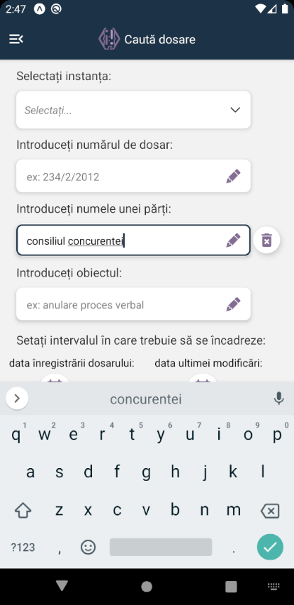
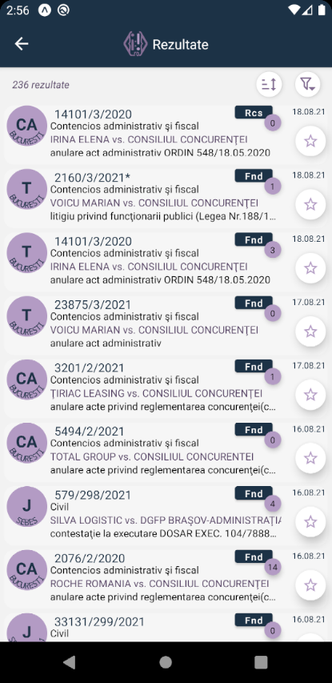
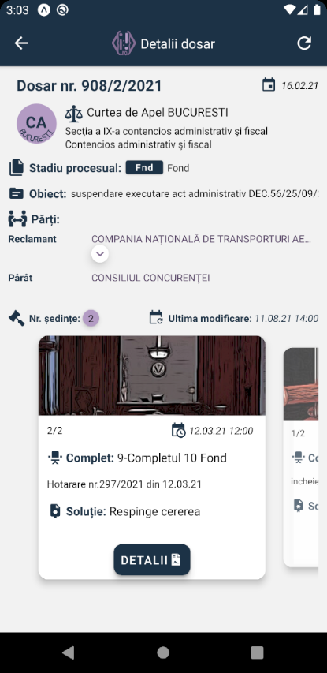

# Just:Alert

## justiția în date deschise, vizualizate într-un format prietenos

Aplicația **Just:Alert** permite accesul instant la dosarele aferente proceselor de la orice judecătorie, tribunal ori curte de apel.

Cu **Just:Alert**, din câteva clickuri, oricine poate căuta, consulta, salva ori monitoriza un dosar de instanță.

**Just:Alert** este o aplicație care permite gestionarea dosarelor pe telefon la fel de ușor ca modul de gestionare a emailurilor într-o aplicație de tip client email.

**Toate căutările, salvările și alertele de modificare sunt generate și stocate exclusiv pe telefonul utilizatorului, asigurându-se confidențialitatea utilizării. Nici dezvoltatorul aplicației, nici vreun terț nu au acces la căutările, salvările ori alertele unui utilizator.**

De acum, accesarea pe telefon a dosarelor de instanță nu mai trebuie să fie o experiență frustrantă, rezervată doar experților.

Fie că ești interesat de stadiul unui dosar în care ești parte, fie că vrei să fii la curent cu evoluția dosarelor unor clienți ori parteneri de afaceri, ori te interesează detaliile unui dosar de notorietate pentru opinia publică, cu **Just:Alert** poți vedea imediat informația relevantă și poți primi automat notificări/alerte prompte despre cele mai recente actualizări ale procedurilor judiciare în derulare.

Sursa primară a datelor este portalul Ministerului de Justitie [portal.just.ro](http://portal.just.ro/SitePages/acasa.aspx), care publică în format de date deschise informațiile disponibile publicului din cadrul sistemului informatic ECRIS al instanțelor de judecată din România.

Datele sunt prelucrate și redate vizual într-o formă mai accesibilă decât cea disponibilă pe site-ul ministerului. **Just:Alert** oferă functionalități suplimentare de căutare, sortare și filtrare a dosarelor, după multiple criterii, precum și notificarea automată pe telefon la momentul apariției oricăror modificări ale stadiului unui dosar de instanță.

> Atenție: aplicația **Just:Alert** este în prezent în stadiul de **testare publică** (beta), toate funcționalitățile aplicației fiind disponibile gratuit. La sfârșitul perioadei de testare este posibil ca accesul la anumite funcționalități să se facă doar contra cost, ori condiționat de afișarea de conținut publicitar, utilizatorii urmând a fi informați corespunzător.

Funcționalitățile de căutare și monitorizare a dosarelor de instanță sunt dependente atât de accesul la Internet al telefonului utilizatorului, cât și de disponibilitatea serviciului web portal.just.ro. Orice întrerupere a conexiunii ori a disponibilității serviciului web (inclusiv o reconfigurare a modului de ) poate perturba corecta funcționare a aplicației, fapt ce nu este în responsabilitatea dezvoltatorului.

Politica de confidențialitate este disponibilă [aici](privacy.md).

---

**E.X.AppDevs** folosește platforme cunoscute și instrumente de ultimă oră pentru dezvoltarea de software pentru aplicații web și platforme mobile iOS și Android.

## Contactează-ne

Dacă aveți întrebări sau sugestii, nu ezitați să ne contactați la:

